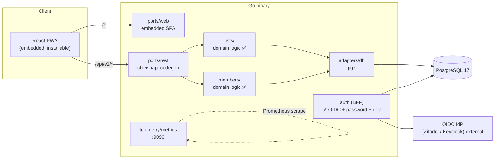
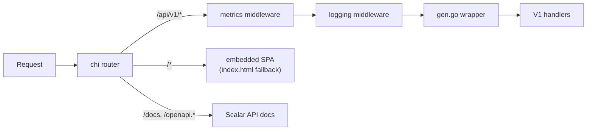
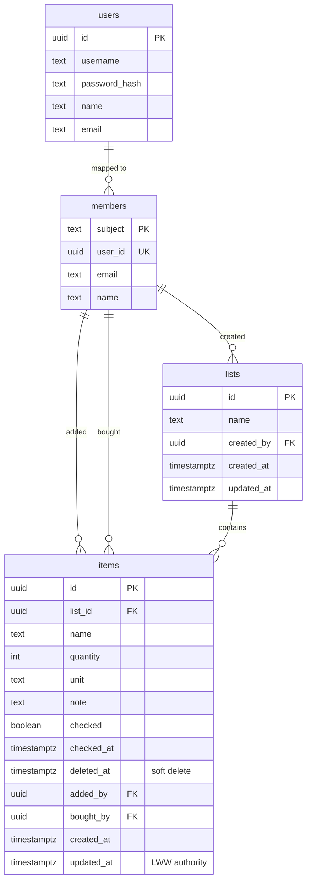
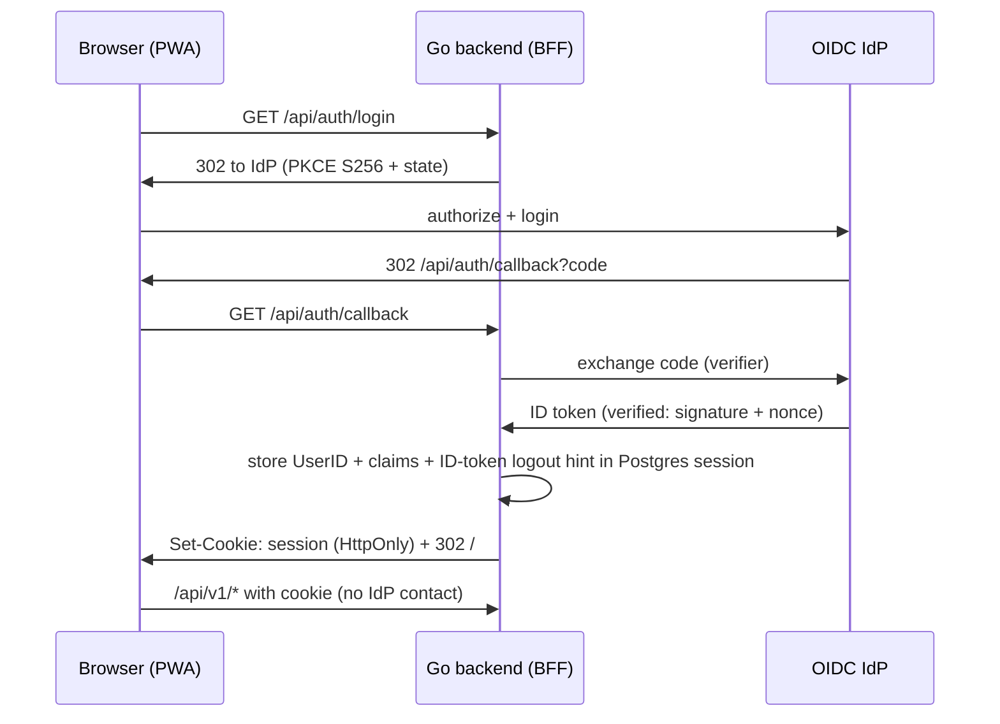

# Splitkauf Architecture

This is a living document. It describes both the **implemented** foundation and the
**planned** target architecture derived from the research in `docs/research/` and
`docs/agents/research/`. Each section is marked accordingly:

- ✅ **Implemented** — exists in code today.
- 🔜 **Planned** — decided in research, not yet built.

Last updated: 2026-08-14.

---

## 1. Overview

Splitkauf is a self-hosted, collaborative shopping list application: shared lists
that a household edits together, in real time, on their phones.

The system ships as a **single self-contained Go binary**: the React PWA frontend is
built by Vite and embedded via `go:embed`. The only external runtime dependency is
PostgreSQL.

---

## 2. Architectural Style ✅

The backend follows a **hexagonal (ports & adapters)** layout, adapted from the
community Go template research (`docs/research/go-backend-community-template.md`):

| Directory     | Role |
|---------------|------|
| `cmd/`        | Cobra CLI entry points: `serve`, `migrate` |
| `config/`     | Viper singleton; env (`SPLITKAUF_` prefix) > `config/config.yaml` > defaults |
| `ports/rest/` | Inbound HTTP adapter — chi router, generated handlers, middleware |
| `ports/web/`  | Inbound adapter serving the embedded SPA (`go:embed all:dist`) |
| `adapters/db/`| Outbound adapter — pgx v5 stdlib `*sql.DB` |
| `lists/`      | Domain/application logic for shopping lists and items ✅ |
| `members/`    | Domain/application logic for member profiles ✅          |
| `users/`      | Domain/application logic for password-provisioned accounts ✅ |
| `app/`        | Not used; domain logic is intentionally split by aggregate |
| `telemetry/`  | Named Zap logging, custom Prometheus registry |
| `database/`   | golang-migrate migrations, embedded via `iofs` |
| `client/`     | Generated typed Go client for the API |
| `frontend/`   | React/Vite/TypeScript PWA source |

**Spec-first API**: `splitkauf.openapi.yaml` at the repo root is the single source of
truth. `oapi-codegen` generates both the chi server stub (`ports/rest/v1/gen.go`) and
the typed client (`client/client.gen.go`). Generated files are committed, not built in
Docker.

### Request flow ✅

---

## 3. Frontend ✅ / 🔜

**Stack** ✅: React 19, TypeScript, Vite, `vite-plugin-pwa` (autoUpdate, app-shell
precache), oxlint + Prettier, Vitest + React Testing Library. Build output goes to
`ports/web/dist` (gitignored) and is embedded into the binary. The dev server proxies
`/api` → `localhost:8080`.

**PWA / iOS** (from `docs/research/pwa-ios-support.md`):

- ✅ Manifest (`display: standalone`, `theme_color`), iOS meta tags
  (`apple-mobile-web-app-capable`/`-status-bar-style`/`-title`,
  `viewport-fit=cover`), real icon artwork (`apple-touch-icon` 180px + 192/512
  PNG + a 512 `maskable` entry). Verified against
  `docs/agents/research/2026-07-21-pwa-ios-support.md` for M4 US-O.1 (install is
  manual Share → Add to Home Screen; no `beforeinstallprompt` on Safari).
- 🔜 Custom in-app install banner on iOS (no `beforeinstallprompt` on Safari):
  detect via `navigator.standalone === false`, show once, re-show after 7 days.
  US-O.1 ships as **manifest verification only**; this banner stays deferred.
- 🔜 Web Push via VAPID; on iOS only available after home-screen install, so request
  permission only in `display-mode: standalone` and after a user gesture.
- ✅ No Background Sync API on iOS — the offline outbox instead drains on
  `online` / `visibilitychange` (and after cache restore), see the offline-first
  data layer below.
- Capacitor is explicitly **deferred** until notification reach becomes a blocker.

**Offline-first data layer** ✅ (M4; a recorded **deviation** from the Dexie +
custom `offline_queue` recommendation in `docs/research/collaborative-lists.md` §4):

- The React Query cache is **persisted to IndexedDB**
  (`PersistQueryClientProvider` + an async-storage-persister over `idb-keyval`,
  `maxAge`/`gcTime` 7 days, a build-hash `buster`, cleared on logout) — every
  visited view renders offline with no component changes.
- Offline writes are React Query **paused mutations** (the outbox): mutations run
  `networkMode: 'offlineFirst'` with a retry policy that pauses on network failure
  and fails fast on 4xx problems; the persisted paused mutations are the outbox and
  survive a reload via module-scope `setMutationDefaults`.
- **Pending-create coalescing** (in place of ID remapping): an offline add mints a
  temp UUID and registers its payload in a `pendingCreates` map; check/edit/delete
  on a still-queued item fold into — or cancel — that one create, so replay never
  references an ID the server has not seen.
- Resume: `resumePausedMutations()` on `online` / `visibilitychange` and after
  cache restore; a replay hitting 404 is dropped with a refetch and a quiet notice.
  Convergence follows the LWW rules in §5.
- **Deviation rationale**: the Dexie research pre-dates the React Query frontend;
  reusing the existing optimistic `onMutate`/`onError` code as the source of truth
  collapses local store + sync queue into one state layer (the mutation cache).

**UX foundations** ✅ / 🔜 (from
`docs/agents/research/2026-07-31-mobile-first-shopping-list-ux.md`; binding for
all UI work via the user-stories UX guardrails):

- ✅ Mobile-first, one-handed in-store use: bottom-anchored quick-add that keeps
  the keyboard open for chained adds; full-row tap targets ≥48dp (`.row-tap-target`,
  `.primary-button`, `.icon-button`, `.quick-add input`); checked items collapse
  into a "done" section (`ListDetail.tsx`).
- ✅ No confirmation dialogs or blocking spinners in the core loop — optimistic
  updates with undo snackbars for soft delete (`useUndoQueue.ts`, `Snackbar.tsx`).
- ✅ 8pt spacing grid, ≥16px body text, safe-area insets, system-following dark
  mode, and WCAG 2.2 AA contrast in both themes — enforced by
  `frontend/src/accentContrast.test.ts` parsing the actual CSS tokens.
- 🔜 Material 3 list-component anatomy is not explicitly followed; the current
  UI is a custom mobile-first style rather than an M3 component set.

---

## 4. Domain Model ✅ / 🔜

The implemented schema (migrations 000001–000007) is below. It is a subset of the
target model from `docs/research/collaborative-lists.md`:

**Implemented** ✅:

- `lists` and `items` with full CRUD, copy, check/uncheck, and restore.
- **Soft deletes** on items (`deleted_at`) with server-backed restore; list delete
  remains a hard cascade.
- **Units** (migration 000005): a curated German/European set enforced by a domain
  allow-list, an OpenAPI enum, and a PostgreSQL `CHECK` constraint.
- **Attribution** (migration 000007): `lists.created_by`, `items.added_by`,
  `items.bought_by` store the actor's UUID; display names resolve at read time by
  joining `members.user_id`, so renames propagate to past actions.
- **Sessions** and **members** tables for the BFF auth layer.

**Not yet implemented** 🔜:

- `categories` table and item categorization.
- Fractional `sort_order` for drag-to-reorder; items currently render in creation
  order.
- Per-item `assignee_id`; attribution only records who added/bought an item.
- List-level membership/roles table beyond the provider-derived `members` rows.

---

## 5. Collaboration & Sync ✅ / 🔜

From `docs/research/collaborative-lists.md`:

- **Conflict resolution** ✅: last-write-wins per item, using the server-assigned
  `updated_at` as the authority. CRDTs (Yjs/Automerge) were evaluated and explicitly
  rejected as overkill for the shopping-list conflict profile.
- **Server push** ✅: **SSE** (not WebSocket) for list-change notifications, with a
  synthetic `reconnect` event that invalidates the cache. WebSocket is reconsidered
  only if presence/live cursors are ever added.
- **Offline queue** ✅ (M4): mutations are React Query **paused mutations** persisted
  to IndexedDB, replayed via `resumePausedMutations()` on `online` /
  `visibilitychange` and after cache restore — **not** the Dexie queue of the
  research (see §3 for the layer and the recorded deviation, and for the iOS
  Background-Sync constraint).
- **Soft delete & restore** ✅ (M4): item deletes set `items.deleted_at` and keep the
  row; every read and count filters `deleted_at IS NULL` (the count aggregates carry
  the predicate in the `LEFT JOIN … ON` clause so empty / all-deleted lists still
  appear). Undo is a server-backed restore —
  `POST /api/v1/lists/{listId}/items/{itemId}/restore` clears `deleted_at`
  (idempotent) — so undo is correct across devices and works offline like any other
  mutation. **List** delete stays a hard cascade; no tombstone purge yet.

---

## 6. Authentication ✅

From `docs/research/oidc-go-pwa-integration.md`. **Decisions committed**
(Postgres-only stack — no Redis):

**Auth modes**, selected from config (`config.Mode()`): OIDC and password can
run **combined** (both configured → mode `oidc+password`, the login page offers
the password form plus a "Sign in with SSO" button); otherwise whichever one is
configured, else dev-auth:

- **OIDC BFF** (✅ M2) — the confidential-client Authorization Code + PKCE flow
  below, when the OIDC issuer/client are configured.
- **Username/password** (✅ M7) — local accounts for instances without an
  identity provider, enabled by `SPLITKAUF_AUTH_PASSWORD_ENABLED`. Accounts are
  operator-provisioned via the `useradd` CLI (no public sign-up) and stored in a
  `users` table (unique username + bcrypt `password_hash`). Login POSTs
  credentials to `/api/auth/login`; on success it establishes the **same scs
  session** the OIDC flow uses, so `RequireAuth`, logout, and durable Postgres
  sessions are identical across modes. An unknown user and a wrong password return the same 401 and both run a
  bcrypt comparison (dummy hash on miss) so timing/response can't enumerate
  usernames. `GET /api/auth/config` reports the active mode so the SPA renders
  the right login UI.
- **Dev-auth** (✅ M1) — a single hardcoded user for local development.

| Concern | Decision |
|---------|----------|
| Pattern | **BFF (Backend for Frontend)** — the Go backend completes the login flow; the browser holds only an opaque `HttpOnly`/`Secure`/`SameSite=Lax` session cookie. Tokens never reach the browser. |
| IdP's role | **Authentication only** — the IdP replaces the username/password input, nothing more. The session stores no access or refresh token and no token expiry: only the resolved `UserID`, the subject/email/name claims, and the ID token kept solely as the `id_token_hint` for RP-initiated logout. `RequireAuth` never contacts the IdP; IdP-side revocation takes effect at the next login. Scopes: `openid profile email`. |
| OIDC client | `coreos/go-oidc/v3` + `golang.org/x/oauth2` — **provider-agnostic**, works with both Zitadel and Keycloak; no IdP-specific SDK. |
| Sessions | `alexedwards/scs/v2` with **`postgresstore`** — sessions live in PostgreSQL, keeping the deployment at a single external dependency. Session expiry in **all** modes is governed solely by the scs session lifetime (`auth.session.lifetime`, default 168h). |
| PKCE | S256 mandatory on every authorization request (RFC 9700). |
| Roles | **Database table**, not IdP claims — the IdP only authenticates; splitkauf owns authorization (list membership, roles). |

Endpoints: `GET /api/auth/login` (OIDC redirect / password GET → home),
`POST /api/auth/login` (password credentials), `GET /api/auth/callback` (OIDC),
`POST /api/auth/logout`, `GET /api/auth/config` (public mode discovery),
`GET /api/v1/me`.

The OIDC flow follows the sequence below; the password flow is a single
credential POST that yields the same session cookie.

Open sub-items (deliberately not yet decided): backchannel logout, multi-tenancy.

---

## 7. Cross-Cutting Concerns

- **Logging** ✅: `telemetry.Logger(names...)` is the *only* logging entry point —
  named Zap loggers, init-once via `sync.OnceFunc`.
- **Metrics** ✅: custom Prometheus registry, RED-style HTTP middleware, served on a
  separate `:9090` server.
- **Configuration** ✅: three-tier precedence — `SPLITKAUF_*` env vars →
  `config/config.yaml` → hard-coded defaults.
- **Migrations** ✅: golang-migrate embedded in the binary; `splitkauf migrate`
  subcommand (`MigrateDown`, `OverrideDirty` available).
- **API docs** ✅: Scalar UI at `/docs`, spec served at `/openapi.yaml|.json`.
- **Error responses (RFC 9457)** ✅: every API error is an RFC 9457 Problem Details
  body with `Content-Type: application/problem+json`. The in-house
  `ports/rest/problem` package owns a registry of four types, each resolving to a
  self-hosted HTML explanation page at `/problems/{slug}` (`about:blank` is never
  used):

  | Slug | Status | Emitted for |
  |------|--------|-------------|
  | `/problems/validation` | 400 | request-validation failures, parameter binding |
  | `/problems/not-found` | 404 | unknown routes under `/api/v1` |
  | `/problems/method-not-allowed` | 405 | unsupported method on a known path |
  | `/problems/internal` | 500 | recovered panics, unexpected faults |

  Four error surfaces feed the registry: the generated router's `ErrorHandlerFunc`,
  the `/api/v1` subrouter's `NotFound`/`MethodNotAllowed` handlers, the
  `middleware.Recover` panic recovery (logs the stack, never leaks internals), and
  the OpenAPI request-validation middleware (`v1.Validator()`, built from the
  embedded spec). A registry drift test proves every emitted type has a page.

  **Convention for new endpoints**: reference the reusable `default` `Problem`
  response (`#/components/responses/Problem`) on every operation in
  `splitkauf.openapi.yaml`. Request validation and uniform error bodies then apply
  automatically.
- **Security headers** 🔜: Content-Security-Policy middleware (from the OIDC security
  checklist) not yet implemented.

---

## 8. Deployment ✅

- **Image**: three-stage Dockerfile (node → golang → `distroless/static:nonroot`),
  published as `ghcr.io/m4schini/splitkauf`. `ENTRYPOINT ["/app"] CMD ["serve"]`.
- **docker-compose**: `postgres:17` (health-checked) + app, configured via
  `SPLITKAUF_DATABASE_*` env vars.
- **Production target**: Podman **quadlets** in `deploy/quadlet/` (network, DB volume,
  DB container, app container with `EnvironmentFile=/etc/splitkauf/splitkauf.env`).
- **CI**: GitHub Actions — build/test for backend, frontend, and Docker; separate lint
  workflow (fmt, golangci-lint, tidy, `govulncheck`). Renovate for dependency updates.

---

## 9. Open Decisions

Deliberately undecided; revisit when the corresponding feature is planned:

1. **IdP choice for the reference deployment** — code stays provider-agnostic
   (`go-oidc`); Zitadel vs. Keycloak is a deployment decision, not a code one.
2. **Backchannel logout** — only relevant once an IdP is operated alongside.
3. **Multi-tenancy** — out of scope for the self-hosted single-instance model for now.
4. **Push notification delivery** — VAPID Web Push design exists in research; the
   subscription endpoint and sender are unscheduled.
5. **Coverage gates** — Vitest coverage thresholds / Codecov are recommended by the
   agentic-coding research but not configured in CI.

---

## References

- `docs/research/go-backend-community-template.md` — backend layout, spec-first tooling
- `docs/research/collaborative-lists.md` — list data model, LWW, SSE, offline
- `docs/research/pwa-ios-support.md` — iOS PWA constraints
- `docs/research/oidc-go-pwa-integration.md` — BFF auth design
- `docs/agents/research/2026-07-31-mobile-first-shopping-list-ux.md` — mobile-first UX foundations
- `docs/agents/plans/2026-07-21-project-setup.md` — foundation implementation plan
