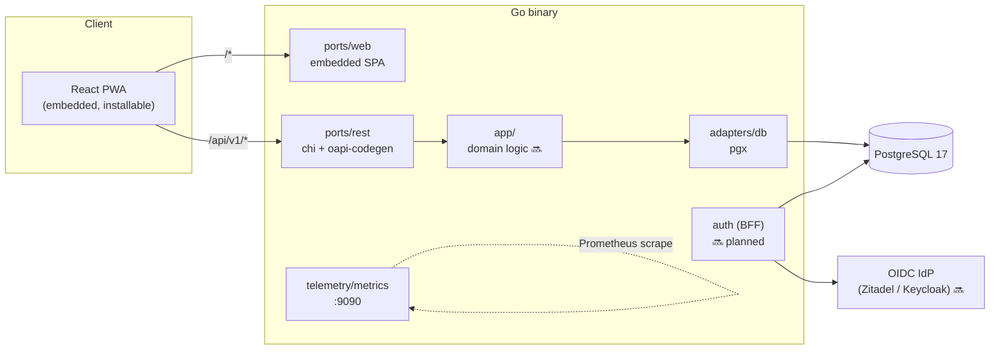
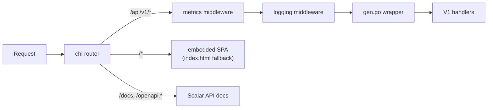
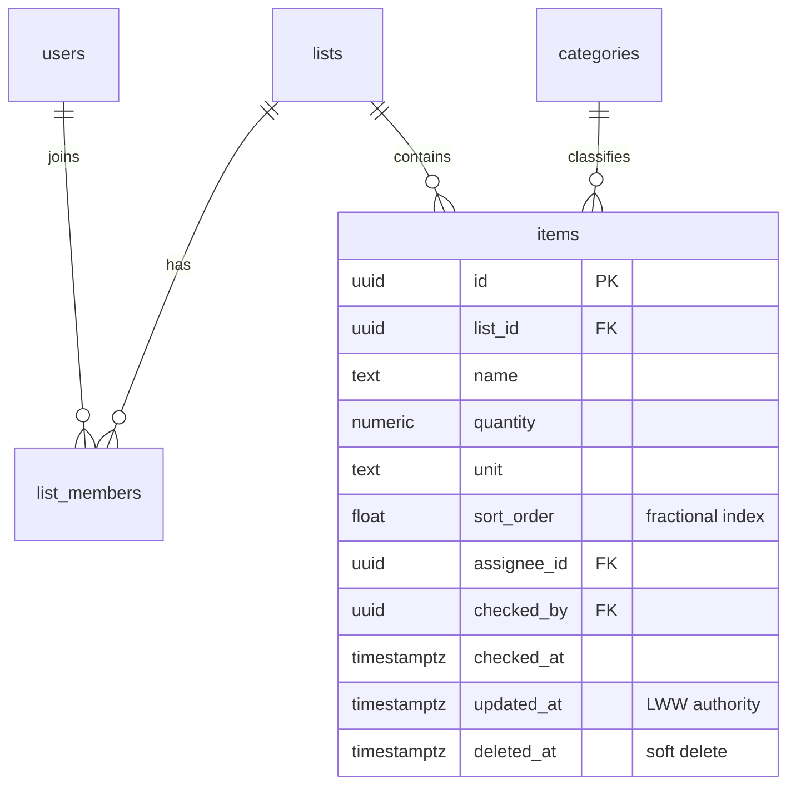
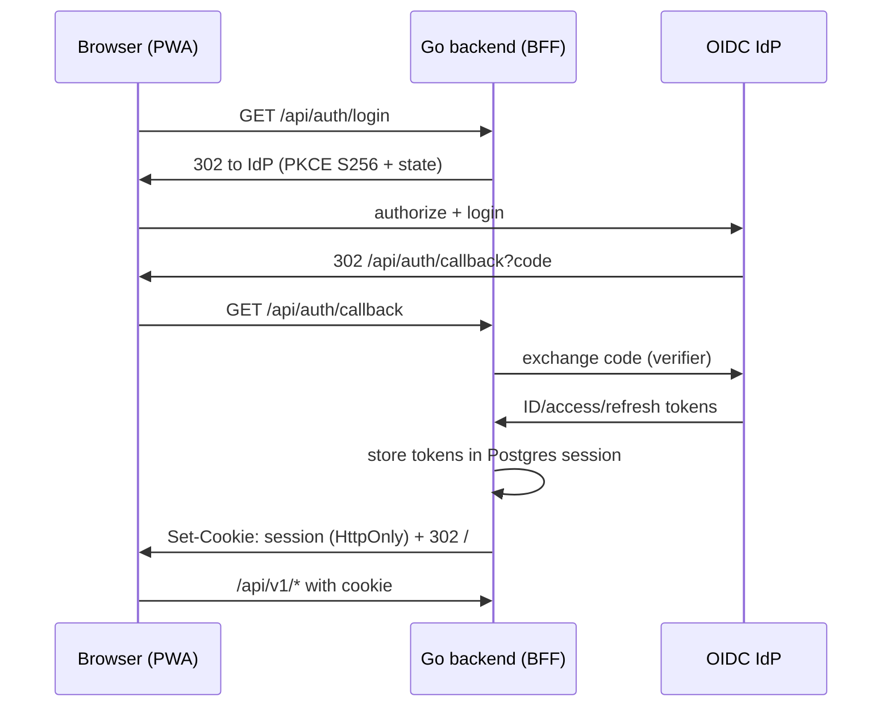

# Splitkauf Architecture

This is a living document. It describes both the **implemented** foundation and the
**planned** target architecture derived from the research in `docs/research/` and
`docs/agents/research/`. Each section is marked accordingly:

- ✅ **Implemented** — exists in code today.
- 🔜 **Planned** — decided in research, not yet built.

Last updated: 2026-07-31.

---

## 1. Overview

Splitkauf is a self-hosted, collaborative shopping list application: shared lists
that a household edits together, in real time, on their phones.

The system ships as a **single self-contained Go binary**: the React PWA frontend is
built by Vite and embedded via `go:embed`. The only external runtime dependency is
PostgreSQL.

---

## 2. Architectural Style ✅

The backend follows a **hexagonal (ports & adapters)** layout, adapted from the
community Go template research (`docs/research/go-backend-community-template.md`):

| Directory     | Role |
|---------------|------|
| `cmd/`        | Cobra CLI entry points: `serve`, `migrate` |
| `config/`     | Viper singleton; env (`SPLITKAUF_` prefix) > `config/config.yaml` > defaults |
| `ports/rest/` | Inbound HTTP adapter — chi router, generated handlers, middleware |
| `ports/web/`  | Inbound adapter serving the embedded SPA (`go:embed all:dist`) |
| `adapters/db/`| Outbound adapter — pgx v5 stdlib `*sql.DB` |
| `app/`        | Domain/application logic (currently empty — reserved 🔜) |
| `telemetry/`  | Named Zap logging, custom Prometheus registry |
| `database/`   | golang-migrate migrations, embedded via `iofs` |
| `client/`     | Generated typed Go client for the API |
| `frontend/`   | React/Vite/TypeScript PWA source |

**Spec-first API**: `splitkauf.openapi.yaml` at the repo root is the single source of
truth. `oapi-codegen` generates both the chi server stub (`ports/rest/v1/gen.go`) and
the typed client (`client/client.gen.go`). Generated files are committed, not built in
Docker.

### Request flow ✅

---

## 3. Frontend ✅ / 🔜

**Stack** ✅: React 19, TypeScript, Vite, `vite-plugin-pwa` (autoUpdate, app-shell
precache), oxlint + Prettier, Vitest + React Testing Library. Build output goes to
`ports/web/dist` (gitignored) and is embedded into the binary. The dev server proxies
`/api` → `localhost:8080`.

**PWA / iOS** (from `docs/research/pwa-ios-support.md`):

- ✅ Manifest (`display: standalone`), iOS meta tags, maskable icons.
- 🔜 Custom in-app install banner on iOS (no `beforeinstallprompt` on Safari):
  detect via `navigator.standalone === false`, show once, re-show after 7 days.
- 🔜 Web Push via VAPID; on iOS only available after home-screen install, so request
  permission only in `display-mode: standalone` and after a user gesture.
- 🔜 No Background Sync API on iOS — drain the offline queue on `visibilitychange` /
  `online` events instead.
- Capacitor is explicitly **deferred** until notification reach becomes a blocker.

**Offline-first data layer** 🔜 (from `docs/research/collaborative-lists.md`):

- Dexie.js (IndexedDB) as the local store plus a sync queue for offline mutations.
- Network-first reads with Dexie fallback; optimistic UI via React Query
  `onMutate`/`onError`.

**UX foundations** 🔜 (from
`docs/agents/research/2026-07-31-mobile-first-shopping-list-ux.md`; binding for
all UI work via the user-stories UX guardrails):

- Mobile-first, one-handed in-store use: bottom-anchored quick-add that keeps
  the keyboard open for chained adds; full-row tap targets ≥48dp; checked
  items collapse into a "done" section.
- No confirmation dialogs or blocking spinners in the core loop — optimistic
  updates with undo snackbars (soft delete).
- M3 list-component anatomy + Apple HIG ergonomics; 8pt spacing grid, ≥16px
  body text, WCAG 2.2 AA contrast in light and dark mode (system-following
  dark mode).

---

## 4. Domain Model 🔜

Nothing beyond `CREATE EXTENSION pgcrypto` exists in migrations yet. The target model
comes from the collaborative-lists research:

Key decisions (from `docs/research/collaborative-lists.md`):

- **Soft deletes**: list items use `deleted_at`, keeping checked/removed items
  recoverable for undo and history.
- **Ordering**: fractional float `sort_order` for drag-reorder without renumbering.
- **Check = record, not delete**: `checked_by`/`checked_at` capture who completed an
  item and when; unchecking restores it.

---

## 5. Collaboration & Sync 🔜

From `docs/research/collaborative-lists.md`:

- **Conflict resolution**: last-write-wins per item, using the server-assigned
  `updated_at` as the authority. CRDTs (Yjs/Automerge) were evaluated and explicitly
  rejected as overkill for the shopping-list conflict profile.
- **Server push**: **SSE** (not WebSocket) for list-change notifications. WebSocket is
  reconsidered only if presence/live cursors are ever added.
- **Offline queue**: mutations queued in Dexie while offline, replayed on
  reconnect/foreground (see §3 for the iOS constraint).

---

## 6. Authentication 🔜

From `docs/research/oidc-go-pwa-integration.md`. This is the largest unimplemented
research area. **Decisions committed** (Postgres-only stack — no Redis):

| Concern | Decision |
|---------|----------|
| Pattern | **BFF (Backend for Frontend)** — the Go backend owns all tokens; the browser holds only an opaque `HttpOnly`/`Secure`/`SameSite=Lax` session cookie. Tokens never reach the browser. |
| OIDC client | `coreos/go-oidc/v3` + `golang.org/x/oauth2` — **provider-agnostic**, works with both Zitadel and Keycloak; no IdP-specific SDK. |
| Sessions | `alexedwards/scs/v2` with **`postgresstore`** — sessions live in PostgreSQL, keeping the deployment at a single external dependency. |
| PKCE | S256 mandatory on every authorization request (RFC 9700). |
| Roles | **Database table**, not IdP claims — the IdP only authenticates; splitkauf owns authorization (list membership, roles). |

Endpoints to add: `GET /api/auth/login`, `GET /api/auth/callback`,
`POST /api/auth/logout`, `GET /api/me`.

Operational note: if Zitadel is used, its 12-hour default access-token lifetime must
be reduced to 5–15 minutes (Keycloak defaults to 5 min).

Open sub-items (deliberately not yet decided): backchannel logout, multi-tenancy.

---

## 7. Cross-Cutting Concerns

- **Logging** ✅: `telemetry.Logger(names...)` is the *only* logging entry point —
  named Zap loggers, init-once via `sync.OnceFunc`.
- **Metrics** ✅: custom Prometheus registry, RED-style HTTP middleware, served on a
  separate `:9090` server.
- **Configuration** ✅: three-tier precedence — `SPLITKAUF_*` env vars →
  `config/config.yaml` → hard-coded defaults.
- **Migrations** ✅: golang-migrate embedded in the binary; `splitkauf migrate`
  subcommand (`MigrateDown`, `OverrideDirty` available).
- **API docs** ✅: Scalar UI at `/docs`, spec served at `/openapi.yaml|.json`.
- **Error responses (RFC 9457)** ✅: every API error is an RFC 9457 Problem Details
  body with `Content-Type: application/problem+json`. The in-house
  `ports/rest/problem` package owns a registry of four types, each resolving to a
  self-hosted HTML explanation page at `/problems/{slug}` (`about:blank` is never
  used):

  | Slug | Status | Emitted for |
  |------|--------|-------------|
  | `/problems/validation` | 400 | request-validation failures, parameter binding |
  | `/problems/not-found` | 404 | unknown routes under `/api/v1` |
  | `/problems/method-not-allowed` | 405 | unsupported method on a known path |
  | `/problems/internal` | 500 | recovered panics, unexpected faults |

  Four error surfaces feed the registry: the generated router's `ErrorHandlerFunc`,
  the `/api/v1` subrouter's `NotFound`/`MethodNotAllowed` handlers, the
  `middleware.Recover` panic recovery (logs the stack, never leaks internals), and
  the OpenAPI request-validation middleware (`v1.Validator()`, built from the
  embedded spec). A registry drift test proves every emitted type has a page.

  **Convention for new endpoints**: reference the reusable `default` `Problem`
  response (`#/components/responses/Problem`) on every operation in
  `splitkauf.openapi.yaml`. Request validation and uniform error bodies then apply
  automatically.
- **Security headers** 🔜: Content-Security-Policy middleware (from the OIDC security
  checklist) not yet implemented.

---

## 8. Deployment ✅

- **Image**: three-stage Dockerfile (node → golang → `distroless/static:nonroot`),
  published as `ghcr.io/m4schini/splitkauf`. `ENTRYPOINT ["/app"] CMD ["serve"]`.
- **docker-compose**: `postgres:17` (health-checked) + app, configured via
  `SPLITKAUF_DATABASE_*` env vars.
- **Production target**: Podman **quadlets** in `deploy/quadlet/` (network, DB volume,
  DB container, app container with `EnvironmentFile=/etc/splitkauf/splitkauf.env`).
- **CI**: GitHub Actions — build/test for backend, frontend, and Docker; separate lint
  workflow (fmt, golangci-lint, tidy, `govulncheck`). Renovate for dependency updates.

---

## 9. Open Decisions

Deliberately undecided; revisit when the corresponding feature is planned:

1. **IdP choice for the reference deployment** — code stays provider-agnostic
   (`go-oidc`); Zitadel vs. Keycloak is a deployment decision, not a code one.
2. **Backchannel logout** — only relevant once an IdP is operated alongside.
3. **Multi-tenancy** — out of scope for the self-hosted single-instance model for now.
4. **Push notification delivery** — VAPID Web Push design exists in research; the
   subscription endpoint and sender are unscheduled.
5. **Coverage gates** — Vitest coverage thresholds / Codecov are recommended by the
   agentic-coding research but not configured in CI.

---

## References

- `docs/research/go-backend-community-template.md` — backend layout, spec-first tooling
- `docs/research/collaborative-lists.md` — list data model, LWW, SSE, offline
- `docs/research/pwa-ios-support.md` — iOS PWA constraints
- `docs/research/oidc-go-pwa-integration.md` — BFF auth design
- `docs/agents/research/2026-07-31-mobile-first-shopping-list-ux.md` — mobile-first UX foundations
- `docs/agents/plans/2026-07-21-project-setup.md` — foundation implementation plan
